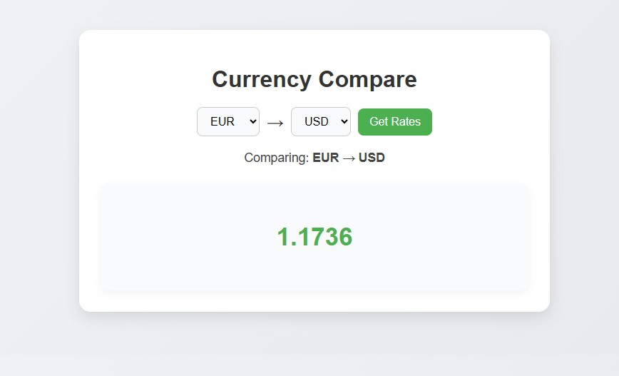

# Currency Compare

A clean and interactive **currency converter and comparator** web app. Compare live exchange rates between different currencies with a user-friendly interface, responsive design, and animated loading indicators. Built with **Node.js, Express, and EJS**.

---

## 📸 Screenshot

  


---

## ✨ Features

- Compare live exchange rates between any two currencies.
- Clean, responsive, and modern design.
- Animated loading indicator while fetching rates.
- Maintains selected currencies after submitting.
- Simple and easy-to-use interface.

---
## 🚀 How to Run the Project

Follow these steps to run the project locally:

**Step 1: Clone the repository**
```bash
git clone https://github.com/pouriavj/currency-compare.git
cd currency-compare
```
**Step 2: Install dependencies**
```bash
npm install
```
**Step 3: Start the server**
```bash
node index.js
```
By default, the website will run on http://localhost:3000.

Step 4: Change the port number (optional)
Open index.js and modify the line:
```javascript
const port = 3000; // change 3000 to any port number you want
```
Then restart the server to use the new port.
## 💻 Usage Instructions

1. Select the **currency to convert from** from the first dropdown.  
2. Select the **currency to convert to** from the second dropdown.  
3. Click **Get Rates**.  
4. The converted amount will appear instantly with a loading spinner while fetching the data.  
5. The selected currencies remain selected after submission for easy comparison.

## 🛠️ Built With

- [Node.js](https://nodejs.org/)
- [Express](https://expressjs.com/)
- [EJS](https://ejs.co/)
- HTML, CSS, JavaScript

---

## 📄 License

This project is open-source and free to use.

