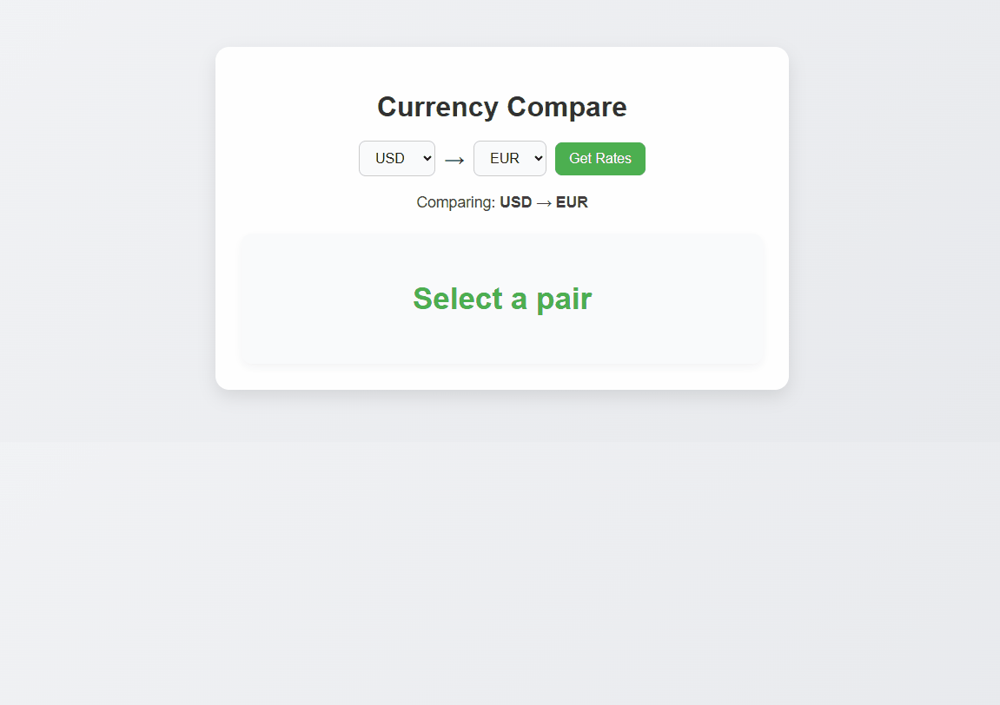

# Currency Compare


A clean and interactive **currency converter and comparator** web app. Compare live exchange rates between different currencies with a user-friendly interface, responsive design, and animated loading indicators. Built with **Node.js, Express, and EJS**.

---

## 🎬 Demo

  


---

## ✨ Features

- Compare live exchange rates for the supported currencies.
- Clean, responsive, and modern design.
- Animated loading indicator while fetching rates.
- Maintains selected currencies after submitting.
- Simple and easy-to-use interface.

---
## 🚀 How to Run the Project

Follow these steps to run the project locally:

**Step 1: Clone the repository**
```bash
git clone https://github.com/pouriavj/currency-compare.git
cd currency-compare
```
**Step 2: Install dependencies**
```bash
npm install
```
**Step 3: Start the server**
```bash
node index.js
```
By default, the website will run on http://localhost:3000.

Step 4 (optional): Change the port number 
Open index.js and modify the line:
```javascript
const port = 3000; // change 3000 to any port number you want
```
Then restart the server to use the new port.
## 💻 Usage Instructions

1. Select the currency you want to convert.  
2. Select the currency you want to convert into.  
3. Click **Get Rates**.  
4. The converted amount will appear instantly with a loading spinner while fetching the data.  
5. The selected currencies remain highlighted after submission for easy comparison.

### 💰 Available Currencies

- USD, EUR, GBP, JPY, AUD, CAD, CHF, CNY, BGN, CZK, DKK, HKD, HUF, INR, KRW, MYR, NOK, NZD, PHP, PLN, RON, SEK, SGD, THB, TRY, ZAR

### 📡 API Source  

This project uses the [Frankfurter API](https://www.frankfurter.dev/) to fetch live currency exchange rates.


## 🛠️ Built With

- [Node.js](https://nodejs.org/)
- [Express](https://expressjs.com/)
- [EJS](https://ejs.co/)
- HTML, CSS, JavaScript

---

## 📄 License

This project is open-source and free to use.

